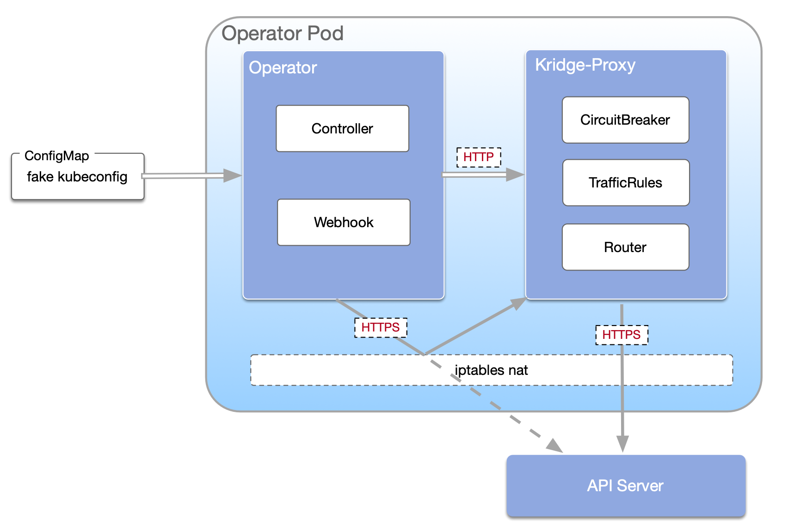

[简体中文](https://github.com/KusionStack/kusion/blob/main/README-zh.md)
| [English](https://github.com/KusionStack/kusion/blob/main/README.md)

# Kridge

Kridge is a solution that helps developers manage their controllers/operators better.

The design architecture of this project is based on [openkruise/controllermesh](https://github.com/openkruise/controllermesh).

## Key Features

1. **Sharding**: Through relevant configurations, Kubernetes single-point deployed operator applications can be flexibly shard deployed.
2. **Canary upgrade**: Depends on sharding, the controllers can be updated in canary progress instead of one time replace.
3. **Circuit breaker and rate limiter**: Not only Kubernetes operation requests, but also other external operation requests.
4. **Multicluster routing and sharding**: This feature is supported by [kusionstack/kaera(karbour)]()

<p align="center"></p>

## Quick Start
Visit [Quick Start]().


## Installation
**Install by helm**
```shell
# Firstly add charts repository if you haven't do this.
$ helm repo add kusionstack https://kusionstack.io/charts

# [Optional]
$ helm repo update

# Install the latest version.
$ helm install kridge kusionstack/kridge --version v0.1.0

# Uninstall
$ helm uninstall kridge
```
**Proxy**  
1. Apply your [ShardingConfig]().
2. Add label `kridge.kusionstack.io/enable-proxy=true` on pod template.


## Principles

Generally, a `kridge-proxy` container will be injected into each operator Pod that has configured in Kridge.
This proxy container will intercept and handle the connection by between API/Oth Server and controllers/webhooks in the Pod.

<p align="center"></p>

ApiServer proxy method:
- *iptables nat*: 
- *fake kubeconfig*: 

The `kridge-manager` dispatches rules to the proxies, so that they can route requests according to the rules.


A core CRD in Kridge is `ShardingConfig`. It contains all rules for user's controller:

```yaml
apiVersion: kridge.kusionstack.io/v1alpha1
kind: ShardingConfig
metadata:
  name: sharding-demo
  namespace: operator-demo
spec:
  controller:
    leaderElectionName: operator-leader
  webhook:
    certDir: /tmp/webhook-certs
    port: 9443
  limits:
  - relateResources:
    - apiGroups:
      - '*'
      resources:
      - pods
      - services
    selector:
      matchExpressions:
      - key: kridge.kusionstack.io/namespace
        operator: In
        values:
        - ns-a
        - ns-b
      matchLabels:
      # ...
  selector:
    matchExpressions:
    - key: statefulset.kubernetes.io/pod-name
      operator: In
      values:
      - operator-demo-0
```

- selector: for all pods under a shard. It can be a subset of pods under a StatefulSet.
- controller: configuration for controller, including leader election name
- webhook: configuration for webhook, including certDir and port of this webhook
- limits: shard isolation is achieved through a set of `ObjectSelector`.

When `manager` is first launched, shard labels will be added to all configured resources.

- `kridge.kusionstack.io/sharding-hash`: the hash value calculated based on the namespace ranges from 0 to 31.
- `kridge.kusionstack.io/namespace`: the namespace referring to this resource.
- `kridge.kusionstack.io/control`: under kridge control.


In this repo, Kridge only support `ObjectSelector` type of flow control,
which means the `kridge-proxy `will proxy list&watch requests to the ApiServer, 
and inject a `LabelSelector` into the request param for the requested resource type.


Router:

<p align="center"></p>

